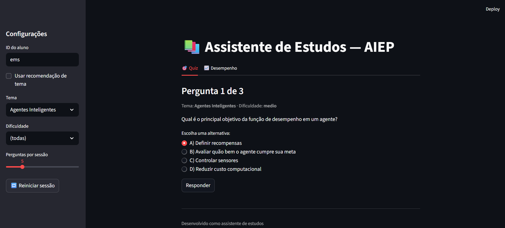
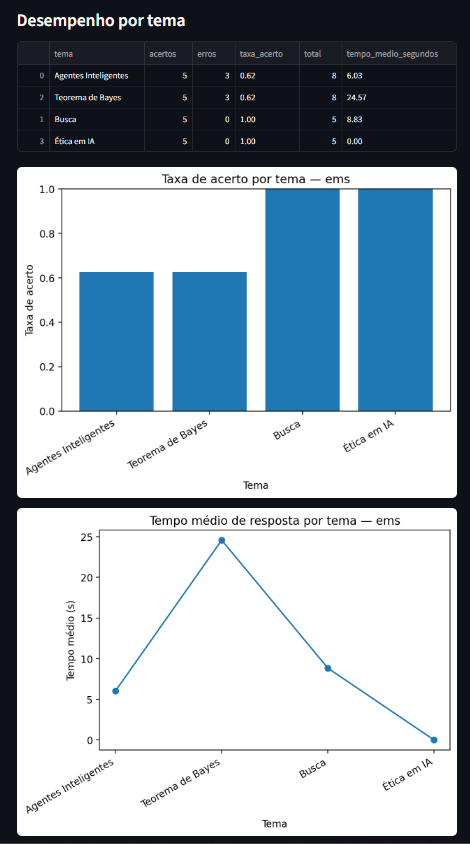
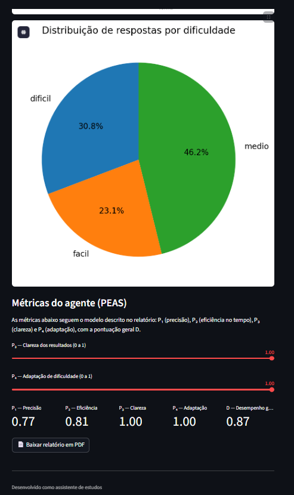
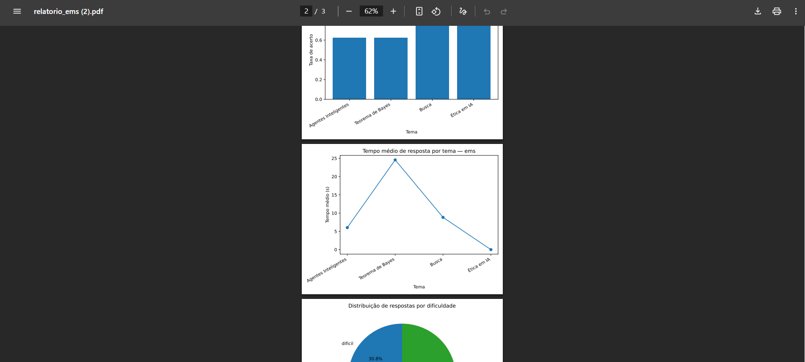

# Assistente de Estudos Inteligente Personalziado - AEIP

**Disciplina:** Introdução à Inteligência Artificial  
**Semestre:** 2025.2  
**Professor:** André Luis Fonseca Faustino
**Turma:** T03 e T04

## Integrantes do Grupo
* Emilly Vitória Rodrigues Gomes Félix (20230067429)
* Nome Completo (Matrícula)
* Nome Completo (Matrícula)

## Descrição do Projeto
Aplicação em **Python** com **linha de comando (CLI)** e **interface Web em Streamlit** para um **Agente Inteligente de Estudos Personalizados (AIEP)**.  
O sistema apresenta questões de múltipla escolha, registra acertos, erros e tempo de resposta por aluno, recomenda próximos temas a partir do histórico e calcula métricas de desempenho do agente segundo o modelo **PEAS** (P₁, P₂, P₃, P₄ e D).  
Foram utilizadas as tecnologias: **Python**, **Streamlit**, **pandas** e **matplotlib**, com armazenamento de histórico em arquivos CSV.

## Guia de Instalação e Execução
```bash*------------------------------------------------------------------------------------------------------------------------------------------------
cd assistente_estudos

# (opcional, recomendado) criar ambiente virtual
python -m venv .venv

# Windows
.venv\Scripts\activate
# Linux/Mac
source .venv/bin/activate

# instalar dependências
pip install -r requirements.txt
```

## Interface Web (Streamlit)
Interface principal para usar o agente de estudos

```bash
streamlit run src/app_streamlit.py
```
* Na interface você pode:

* Informar um ID de aluno;

* Escolher tema, dificuldade e quantidade de questões;

* Iniciar uma sessão de estudo;


* Acompanhar o desempenho na aba  Desempenho:
  
* Tabela por tema (acertos, erros, taxa de acerto, tempo médio);

* Gráfico de barras (taxa de acerto por tema);

* Gráfico de linhas (tempo médio por tema);

* Gráfico de pizza (distribuição de respostas por dificuldade);

* Gráfico de barras (taxa de acerto por dificuldade);

* Métricas do agente (P₁ precisão, P₂ eficiência no tempo, P₃ clareza, P₄ adaptação e D);

* Botão para baixar relatório em PDF com os gráficos.

* Além disso, a lógica de recomendação em recomendador.py usa P₄:

    * P₄ < 0,5 → modo reforço pesado (prioriza temas com pior taxa de acerto);

    * P₄ ≥ 0,5 → modo normal (heurística que prioriza temas com menor taxa de acerto e maior tempo médio).

## Linha de comando (CLI)
```bash
python -m src.executar_sessao --aluno-id ana --num-perguntas 5
# Filtros opcionais:
#   --tema "Lógica"
#   --dificuldade facil|medio|dificil
#   --recomendar-tema   # deixa o agente escolher o próximo tema

```
### Relatório no console + gráfico (CLI)
 ```bash
 python -m src.relatorio --aluno-id ana
# Gráfico salvo em relatorios/desempenho_ana.png
```

## Testes
```bash
pytest -q
``` -->

## Estrutura
```text
assistente_estudos/
├─ src/
│  ├─ app_streamlit.py      # Interface Web (Streamlit)
│  ├─ executar_sessao.py    # CLI para sessões de estudo
│  ├─ recomendador.py       # Lógica de recomendação de temas 
│  ├─ relatorio.py          # Geração de gráfico via linha de comando
│  └─ util_dados.py         # Dados, histórico, métricas (P₁, P₂, P₃, P₄ e D)
├─ dados/
│  ├─ questoes.json         # Banco de questões (tema, dificuldade, alternativas, resposta)
│  └─ historico/            # Histórico por aluno (CSV com acertos, erros, tempo etc.)
├─ relatorios/
│  └─ (gráficos gerados pela versão CLI)
├─ tests/
│  ├─ teste_util_dados.py
│  └─ teste_recomendador.py
├─ requirements.txt
└─ README.md
```

## Resultados e Demonstração










## Referências

  * Documentação do Streamlit: https://docs.streamlit.io
  * Documentação do pandas: https://pandas.pydata.org/docs/
  * Documentação do matplotlib:https://matplotlib.org/
  * Materiais da disciplina de Inteligência Artificial (modelo PEAS, agentes e métricas de desempenho).
